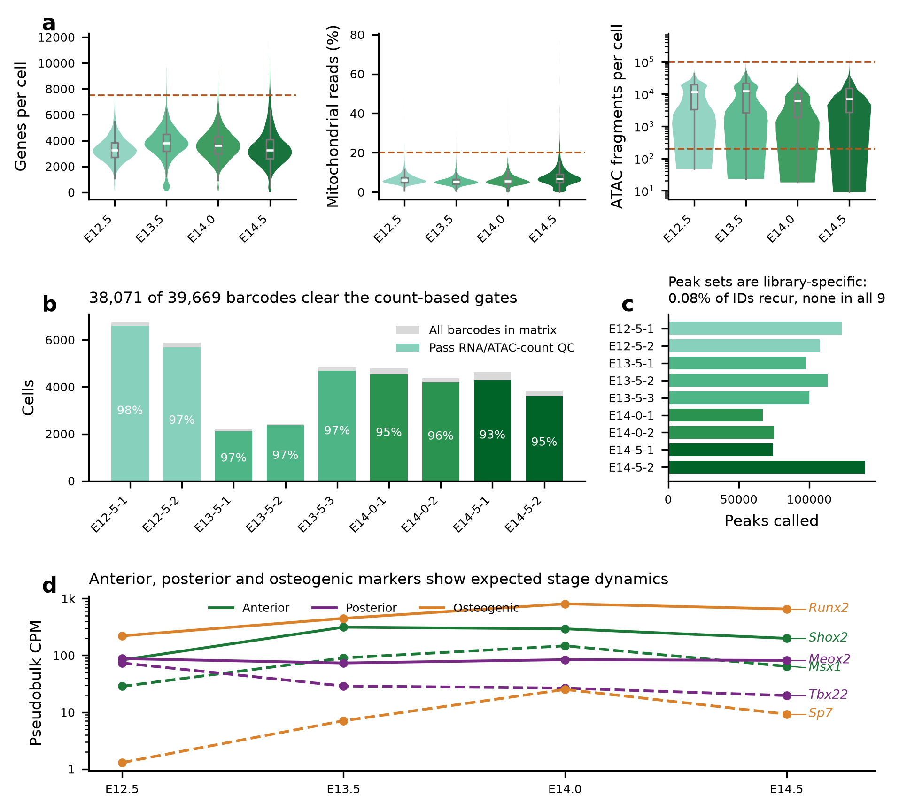
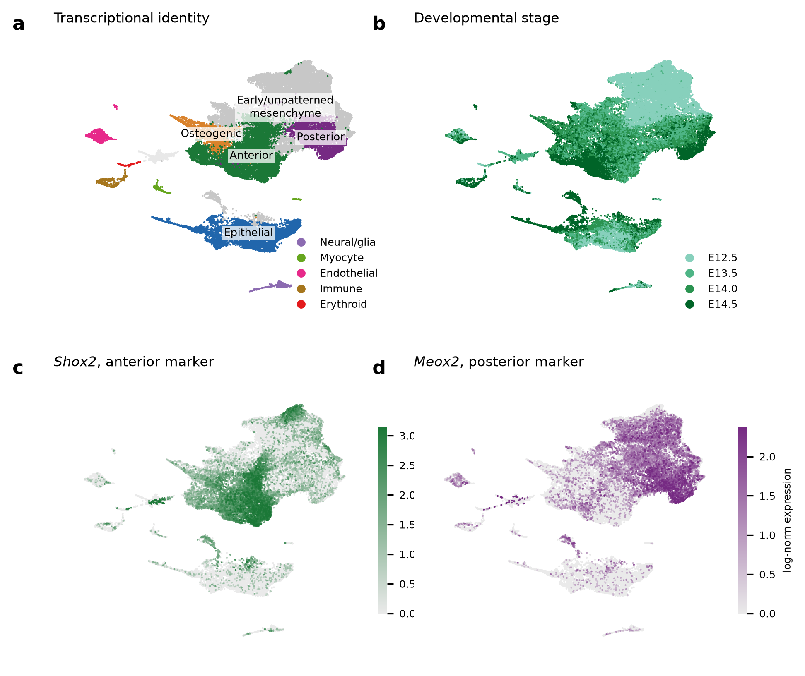
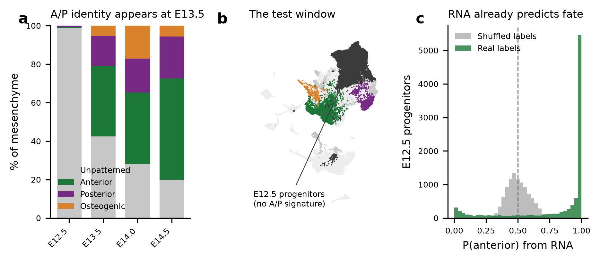

# Chromatin priming of positional fate in the mouse secondary palate


**Is anterior/posterior positional fate primed in chromatin before it appears in transcription?**

> **[Start with the walkthrough notebook →](notebooks/walkthrough.ipynb)**

A reanalysis of [GSE218576](https://www.ncbi.nlm.nih.gov/geo/query/acc.cgi?acc=GSE218576) —
single-cell multiome (paired RNA + ATAC) of mouse secondary palate at E12.5, E13.5, E14.0
and E14.5. This repository contains the feasibility audit, the RNA baseline, and a pilot
result that reframed the question. **The ATAC analysis is not yet implemented**; see
[Status](#status).

This is a reanalysis of public data, not a discovery. The data were generated by
Yan et al. 2024 — see [Credit](#credit).

---

## The question

The secondary palate patterns along its anterior–posterior axis. Anterior mesenchyme
expresses *Shox2* and *Msx1*; posterior expresses *Meox2* and *Tbx22*. By E14.5 the two
territories are transcriptionally distinct. At E12.5 they are not — the cells exist, but
no A/P identity is visible in their RNA.

Chromatin accessibility often changes before the genes it regulates are transcribed. So:
**does chromatin know first?** If accessibility at fate-linked loci is already biased in
progenitors whose transcriptome looks uninformative, positional fate is primed
epigenetically. If not, the two modalities commit together.

This dataset can answer it because both modalities are measured in the same nucleus — no
cross-modality cell matching is required — and because it brackets the transition.

---

## What was found

### 1. The data is usable, peaks set were compared

All nine libraries carry both a filtered feature-barcode matrix and an ATAC fragment file
(cellranger-arc 2.0.0), so no re-alignment from FASTQ is needed. Applying the authors' own
QC thresholds keeps **38,071 of 39,669 barcodes (96.0%)**; they report 36,154 after two
further gates (TSS enrichment > 1, nucleosome signal < 2) that require the fragment files,
and the ~1,900-cell gap is the right size for those.

The problem is the ATAC feature space. Each library was peak-called independently:

| peak IDs shared by | n IDs |
|---|---|
| exactly 1 library | 895,069 |
| exactly 2 libraries | 727 |
| exactly 3 libraries | 1 |
| all 9 libraries | 0 |

Of a 895,797-ID union, **728 IDs (0.081%) recur in any other library**, and the maximum
pairwise Jaccard index is 0.00025. The 729 coincidental matches are cellranger
independently calling identical coordinates — what you would expect by chance, not a shared
vocabulary. All 38k cells must be
re-quantified against a consensus set, which this repo builds by union-merging the
per-library intervals into **196,662 regions** (median width 982 bp, 200 Mb, 7.3% of mm10).




*Per-cell QC against the published thresholds (a), cells retained per library (b),
per-library peak counts against the paper's aggregate set (c), and marker dynamics across
stages (d).*

### 2. The RNA baseline reproduces the expected biology

38,071 cells, 2,500 HVGs selected per library, 50 PCs, Leiden at resolution 1.0 → 31
clusters, annotated from **absolute** mean log-normalized marker expression.

The A/P axis is clean: *Shox2* averages 1.65 in anterior cells vs 0.17 in posterior;
*Meox2* 1.28 vs 0.11. Of the 2,000 highest-*Shox2* cells, 1,699 fall in the anterior
cluster.

| cell type | E12.5 | E13.5 | E14.0 | E14.5 |
|---|---|---|---|---|
| Anterior | 62 | 2,543 | 2,603 | 3,009 |
| Posterior | 56 | 1,075 | 1,240 | 1,250 |
| Osteogenic | 0 | 370 | 1,206 | 324 |
| Early/unpatterned mesenchyme | 10,036 | 2,940 | 1,972 | 1,144 |
| Epithelial | 1,612 | 1,484 | 1,334 | 1,306 |
| **total** | **12,279** | **9,176** | **8,717** | **7,899** |

**99% of E12.5 mesenchyme carries no A/P signature**, and patterning appears from E13.5 —
exactly the window the hypothesis needs.



**One departure from the published annotation:** no chondrocyte cluster could be called.
*Acan* is rarely detected: 1.2% of all cells are positive, and no cluster exceeds 7.05%
(cluster 23, an anterior cluster). Among the six early-mesenchyme clusters that a relative
ranking would call chondrogenic, detection is 0.04–2.9%. Those *Sox9*-low, *Col2a1*-low
E12.5 clusters are therefore labelled early mesenchyme rather than chondrogenic. The
annotation code enforces this: a chondrogenic call requires *Acan* detection above a
configured fraction, because *Sox9*/*Col2a1* alone are expressed in uncommitted palatal
mesenchyme. The original paper analyses a "no chondrocyte" subset; at this clustering
resolution there was no basis for that call.

### 3. The pilot result that reframed the question

Train a logistic classifier to separate anterior from posterior at E14.5, then apply it to
the 10,036 E12.5 cells with no A/P marker signature.

| arm | n | mean P(anterior) | sd | confident calls (p<0.2 or p>0.8) |
|---|---|---|---|---|
| real labels | 10,036 | 0.802 | 0.312 | **82.3%** |
| permuted labels | 10,036 | 0.501 | 0.088 | **0.0%** |

Training AUROC is 0.999 (n=4,259, 5-fold CV). The result survives three controls, each
corresponding to a way it could have been spurious:

- **Stage confound** — projecting out the E12.5-vs-E14.5 discriminant axis leaves the
  signal intact, so it is not maturation signal in disguise.
- **Class imbalance** — the classifier is trained with balanced class weights, so
  confident calls are not a base-rate artifact.
- **Permutation null** — shuffled training labels yield 0% confident calls.

The controls matter. Without stage-axis removal and class balancing, the same classifier
reports 76.8% confident calls, but 12.1% of progenitors also get a confident call from a
classifier trained on *shuffled* labels. That is a confidence floor reached with no fate
information at all, so the naive figure cannot be read at face value. With the controls the
null drops to 0.0%, so every confident call has to come from real label structure. The
controls make the headline number interpretable, not just larger.

| | confident calls | permuted-label null |
|---|---|---|
| naive (no stage-axis removal, unbalanced) | 76.8% | 12.1% |
| with controls | **82.3%** | **0.0%** |



**Why this matters.** "Unpatterned" meant *no marker signature*, not *no information*. The
transcriptome already predicts eventual fate, just not through the four genes used to
define the labels. The original hypothesis — "chromatin is primed before transcription" —
is not directly testable as stated, because its premise is false for this dataset.

The claim has to become: **does chromatin add predictive power over RNA, at matched feature
count and sparsity?** That is a harder test, but it has a clean null and a negative result
stays interpretable.


---

## Conclusion

This reanalysis establishes three things about GSE218576.

1. **The deposited ATAC data cannot be analysed as released.** Each library was peak-called
   independently and only 0.08% of peak IDs recur across libraries, so any cross-sample
   chromatin analysis requires re-quantifying all cells against a consensus peak set
   (built here: 196,662 regions).
2. **A/P positional identity emerges transcriptionally between E12.5 and E13.5.** At E12.5,
   99% of palatal mesenchyme carries no anterior (*Shox2*) or posterior (*Meox2*) marker
   signature; by E13.5 both territories are resolved.
3. **"Unpatterned" E12.5 progenitors already carry fate information in their
   transcriptome.** A classifier trained on E14.5 anterior vs posterior cells assigns
   confident fates to 82.3% of marker-negative E12.5 progenitors, versus 0.0% when trained
   on shuffled labels, after removing the developmental-stage axis and balancing classes.

The consequence is that "chromatin is primed before transcription" cannot be tested as
stated, because its premise is false for this dataset. The meaningful question is narrower:
**does chromatin accessibility predict positional fate better than RNA, at matched feature
count and sparsity?** That comparison has a clean null, and either outcome is interpretable.

**Caveat.** The 82% figure does not yet separate early fate commitment from lineage
continuity or classifier extrapolation beyond the E14.5 training distribution. Calibration on
labelled E13.5 cells and a negative control on non-mesenchymal E12.5 cells would address
this.

**Next step.** Quantify chromatin accessibility for all 38,071 cells against the consensus
peak set and run the RNA-vs-ATAC fate-prediction comparison.

---

## Status

| | |
|---|---|
| Feasibility audit | done |
| RNA QC, embedding, annotation | done |
| RNA baseline for the fate-prediction test | done |
| Consensus ATAC matrix (12.3 GB fragments) | **not started** |
| ATAC fate prediction — the actual comparison | **not started** |
| Peak–gene linkage, motif activity | not started |
| Robustness (seeds, subsampling, leave-one-timepoint-out) | not started |

**Known limitations of what exists.** TSS-enrichment and nucleosome-signal QC are not
applied (they need the fragment files), so cell counts run ~5% above the published
post-QC figure. Cluster labels are marker-derived, not transferred from the authors'
annotation. There is no batch integration beyond per-library HVG selection. The pilot uses
RNA principal components trained at E14.5 and applied at E12.5, so some of the 82% may
reflect lineage continuity rather than early fate commitment — the controls rule out the
cheapest explanations, not all of them.

---

## Installation

```bash
git clone https://github.com/NguyenLinh225/palate-multiome-priming.git
cd palate-multiome-priming
python -m venv .venv && source .venv/bin/activate
pip install -e ".[dev,workflow]"     # drop ,workflow if you only want to run the tests
```

or with conda: `conda env create -f environment.yml && conda activate palate-multiome`.

Python ≥ 3.10 for the package and tests; ≥ 3.11 for `snakemake`. Roughly 8 GB of RAM is enough for the RNA pipeline; the ATAC stage will need
more, or out-of-core handling.

## Usage

```bash
python scripts/01_verify_data.py   # download matrices (~510 MB), reproduce QC, measure peak sharing
python scripts/02_build_rna.py     # QC -> normalize -> embed -> annotate; writes the .h5ad
python scripts/03_priming_rna.py   # RNA baseline for the fate-prediction test
python scripts/04_figures.py       # regenerate figures/
python scripts/05_build_deck.py    # regenerate docs/status_deck.pptx

snakemake -c4                      # or all of the above, in dependency order
```

Every threshold, path and seed lives in [`config/config.yaml`](config/config.yaml); nothing
is hardcoded in `src/`.

**If the GEO download fails.** The NCBI FTP host blocks some networks (institutional
proxies, some cloud ranges) with HTTP 403. The downloader retries, then tells you which file
it needs. Download the nine `*_filtered_feature_bc_matrix.h5` files from the
[GEO page](https://www.ncbi.nlm.nih.gov/geo/query/acc.cgi?acc=GSE218576) by hand and save
them as `data/raw/<sample>.h5` (e.g. `data/raw/B6E12-5-1.h5`). Files already present are
used without touching the network.

```bash
pytest          # 36 tests, synthetic data only, no network needed
ruff check .
```

## Repository layout

```
palate-multiome-priming/
├── config/config.yaml          # paths, thresholds, seeds
├── src/palate_multiome/
│   ├── config.py               # config loading and validation
│   ├── io.py                   # GEO download, 10x HDF5 reading
│   ├── qc.py                   # per-cell metrics, published filter gates
│   ├── peaks.py                # consensus peak merging, sharing diagnostics
│   ├── rna.py                  # normalization, HVG, PCA/UMAP/Leiden
│   ├── annotate.py             # marker-based cluster annotation
│   └── priming.py              # the fate-prediction test and its controls
├── scripts/01–05               # runnable pipeline steps
├── notebooks/walkthrough.ipynb # the readable path through the analysis
├── workflow/Snakefile          # end-to-end orchestration
├── tests/                      # unit tests per module + end-to-end smoke test
├── results/                    # generated tables (committed)
├── figures/                    # generated figures (committed)
├── docs/status_deck.pptx       # 7-slide project summary
└── .github/workflows/ci.yml    # lint + tests on Python 3.10–3.12
```

The notebook imports the package rather than redefining anything, so what it shows is
exactly what the pipeline runs and the tests cover. It is executed and committed with
outputs, so it renders on GitHub without running it.

## Results files

| file | contents |
|---|---|
| `results/day1_verification.csv` | per-library cells, QC pass counts, peak counts, file sizes |
| `results/peak_id_sharing.csv` | how many peak IDs are shared by exactly N libraries |
| `results/celltype_by_stage.csv` | annotated cell counts per stage |
| `results/marker_expression_by_celltype.csv` | mean marker expression backing the labels |
| `results/priming_pilot.csv` | fate-prediction result, real vs permuted labels |
| `results/annotation_method_comparison.csv` | z-score vs absolute-expression calls per cluster |
| `results/priming_controls_ablation.csv` | pilot with and without the stage/balance controls |

## Method notes

**Why absolute expression, not z-scores, for annotation.** Z-scoring marker panels across
cell types asks only which panel is *relatively* highest for a cluster, so a cluster whose
markers are all weakly expressed still gets a confident label. Scoring both ways on this
dataset, the two approaches disagree on 11 of 31 clusters covering 16,723 cells (43.9%).
The disagreements are concentrated in early mesenchyme: z-scoring labels six clusters
(11,459 cells) "chondrogenic" on the strength of *Sox9*/*Col2a1*, but *Acan* is detected in
0.04–2.9% of their cells, so they are uncommitted mesenchyme rather than cartilage. The
well-separated minor lineages (immune, endothelial, erythroid, neural, myocyte) are called
identically by both methods — the failure mode is specific to clusters that are
transcriptionally similar to each other. Thresholds on mean log-normalized expression,
plus the *Acan* detection requirement, avoid it.

**Why the consensus peak set is a union merge.** With no shared peak IDs there is no
intersection to take. A union merge keeps every region any library detected and lets the
prevalence filter (`min_cell_fraction`) remove regions that are not reproducibly
accessible, rather than discarding them up front on library membership.

**Why the priming test is a prediction task.** Positional identity here is spatial, not
temporal — anterior and posterior cells coexist at every stage. A pseudotime "lag" between
accessibility and expression is confounded by the different detection sparsity of the two
modalities, and by the fact that a joint embedding is partly determined by the ATAC signal
being tested. Framing it as *predict the terminal label from the progenitor state* removes
both problems and yields a single cross-validated number with a permutation null.

## Credit

Data from:

> Yan F, Suzuki A, Iwaya C, Pei G, Chen X, Yoshioka H, Yu M, Simon LM, Iwata J, Zhao Z.
> **Single-cell multiomics decodes regulatory programs for mouse secondary palate
> development.** *Nat Commun* **15**, 821 (2024). PMID 38280850 ·
> [doi:10.1038/s41467-024-45199-x](https://doi.org/10.1038/s41467-024-45199-x)
> · [GSE218576](https://www.ncbi.nlm.nih.gov/geo/query/acc.cgi?acc=GSE218576)
> · [analysis code](https://github.com/fangfang0906/Single_cell_multiome_palate)

The same group later published a second analysis of this dataset:

> Hussein U, Dai Y, Liu A, Itai T, Yan F, Simon LM, Zhao Z. **Single-cell multiome
> characterizing intercellular communication and intracellular regulation of epithelium and
> mesenchymal during secondary palate development in mice.** *Comput Struct Biotechnol J*
> **27** (2025). [doi:10.1016/j.csbj.2025.09.031](https://doi.org/10.1016/j.csbj.2025.09.031)
> · PMID 41127818

Neither paper tests whether anterior/posterior positional fate is primed in chromatin ahead
of transcription. Yan et al. characterise the transcriptional and chromatin landscapes and
build trajectories; Hussein et al. address epithelial–mesenchymal WNT/BMP/PDGF signalling.
That gap is what this project occupies.

## License

MIT — see [LICENSE](LICENSE). The data are subject to GEO's terms and remain the authors'.
